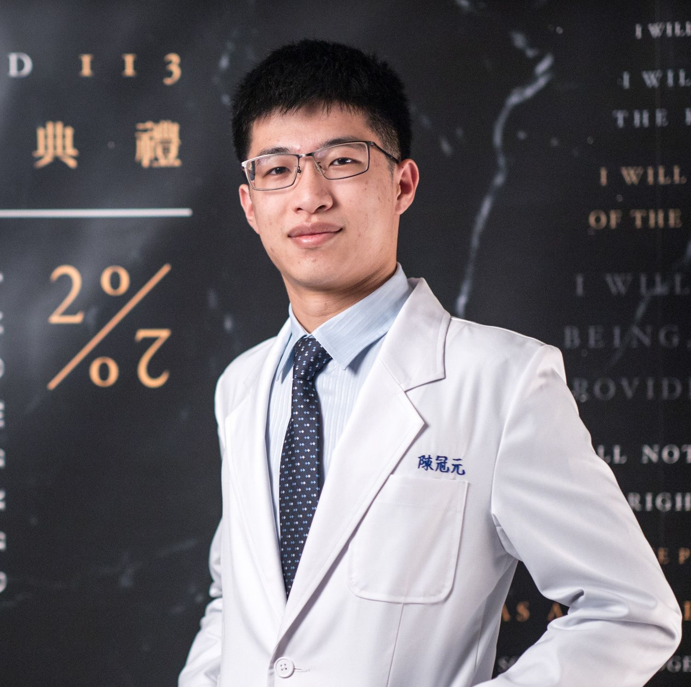

# PulmoCoach

## Abstract 

 &emsp;&emsp; Medical imaging has been widely used as an examination method in hospitals due to its non-invasive characteristic. Among them,chest radiographs, also known as chest x-rays or CXRs,are the most common. However, there have not been many interactive resources that help medical school students and other healthcare providers learn how to interpret medical images. Therefore, the learningcurve for chest radiograph interpretation can be steep and challenging for beginners.

 

 &emsp;&emsp; Based on this situation, our team, composed of members from departments of computer science, electrical engineering, biomedical engineering, and medicine, decided to build a website that can serve as a tutorial and self-evaluation resource aimed at assisting healthcare providers new to CXR interpretation in better understanding some of the most crucial findings in CXR.

 

 &emsp;&emsp; Our platform is free and open-source, and our data is also based on open-source atasets. There are plenty of interesting images with accurate lesion localization and annotations made by professional radiologists. So make sure to try it out!
            
 

 &emsp;&emsp; We are looking forward to incorporating AI diffusion model assistance in the future to make image comparisons and lesion localization easier.

 

## Technical Strucutre 
&emsp;

&emsp;

Our website is powered by a seamless integration of front-end and back-end technologies. We selected Angular as our front-end framework and utilized the dynamic capabilities of Flask and Firebase for the back-end. We entrust Flask to provide APIs for our front-end framework and the Firebase Realtime Database and Firestore for our data and metadata storage. For secure and reliable authentication, we have incorporated the Google Login API. Our website is now hosted on local computer, and will be deployed on the state-of-the-art GCP Platform soon.
For the machine learning model, we develop the model by using tensorflow

##### For more information about Angular, please refer to : https://github.com/angular/angular-cli

&emsp;

## About our Team

##### We are students from NYCU GDSC Taiwan. Following are the member list.
 

    

        
        
Guan-Yuan Chen

        
NYCU Medicine

    

    

        
        
Yung-Cheng Su

        
NTHU CS

    

    

        
        
Hsiao-Ting Shao

        
NYCU CS

    

    

        
        
Cheng-Lin Chen

        
NTHU CS

    

